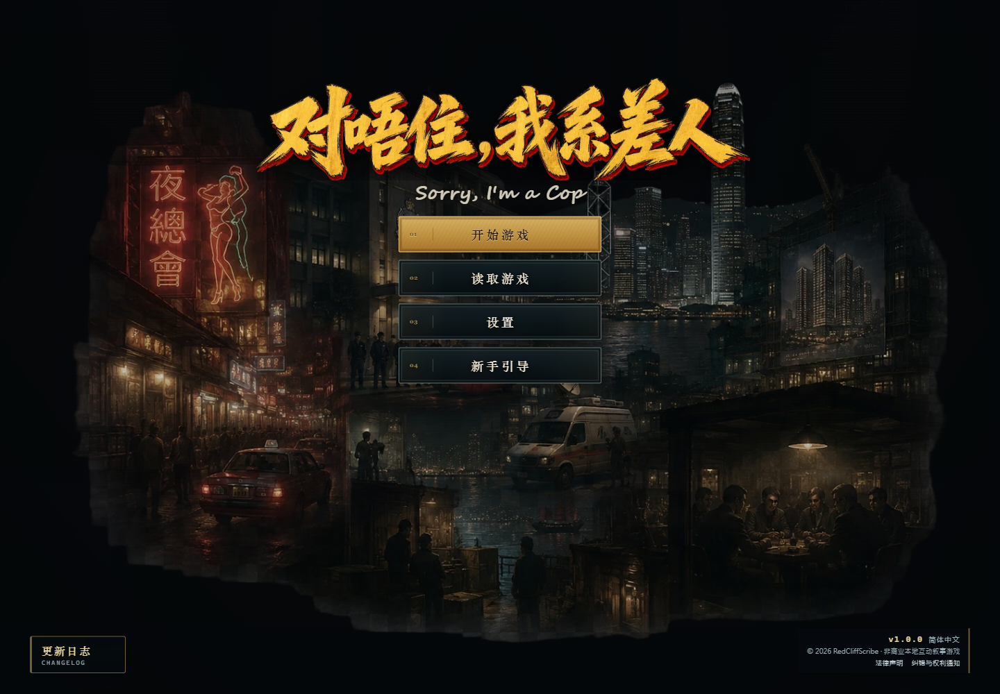
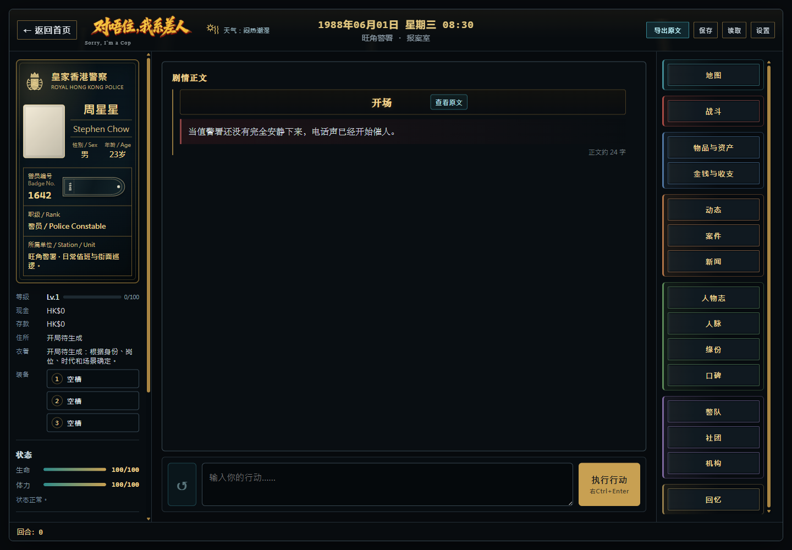
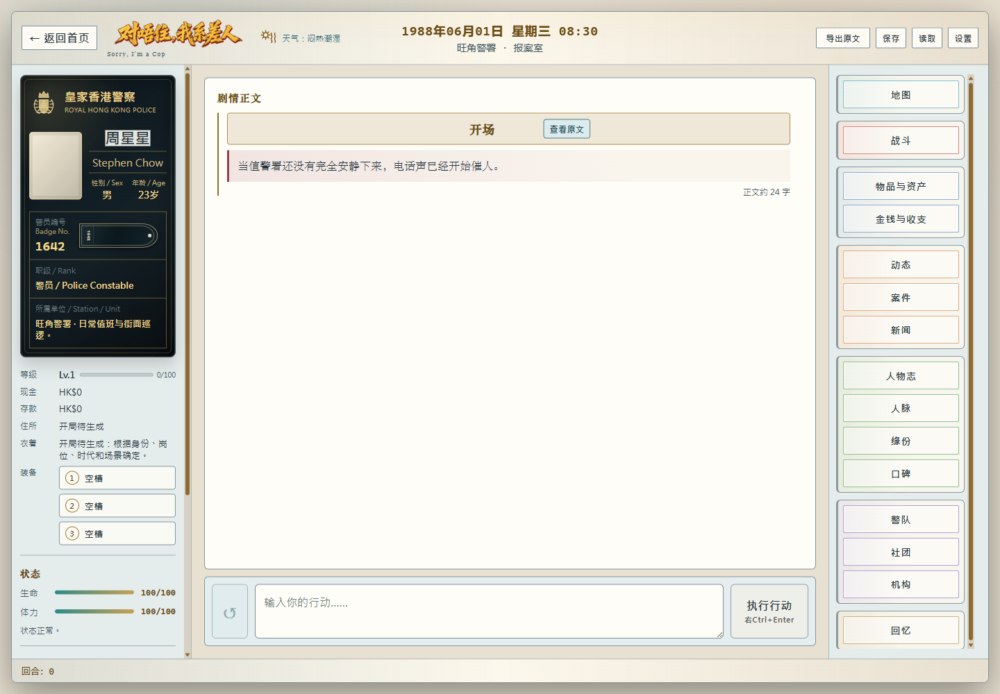
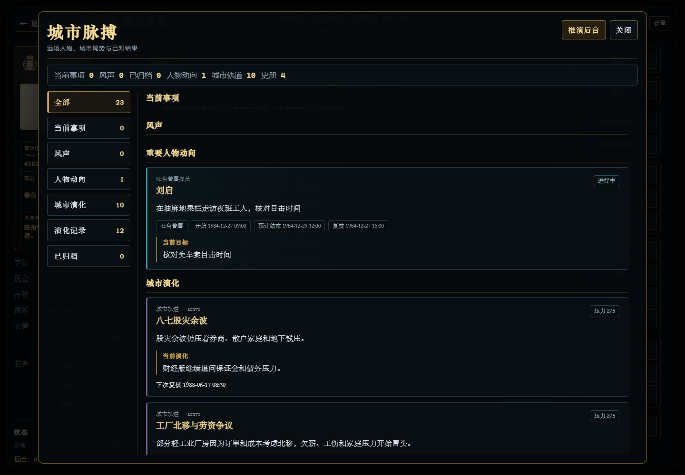

<div align="center">

# 对唔住，我系差人

### Sorry, I'm a Cop

一款以 1980—1996 年香港为舞台、由玩家选择与人工智能共同推动的本地互动叙事 RPG。

[English](README.en.md) · **v1.0.0** · 简体中文首发版

</div>



## 进入一座会继续生活的香港

你可以从警察、社团成员或普通市民开始人生。案件不会永远停在玩家面前，重要人物会在远处行动，机构与社团会积累压力、改变计划，新闻会把已经发生的事重新送回城市。你的身份也不是一张永久不变的职业卡：市民可以走入警队或社团，警察与社团成员也可能以卧底身份生活在另一套公开秩序里。

项目不试图把香港生活压缩成警务流程或固定任务树。LLM 负责理解行动、叙事和推演；本地系统负责保存事实、校验写回、召回记忆，并让后续回合真正承接此前发生过的事。

## 核心体验

- **三种起源与可变化身份**：警察、社团、市民均有独立开局投影；身份转换保留原有家庭、工作、关系与未解决压力。卧底路线以公开身份决定主界面，真实身份仍留在底层状态中。
- **持续世界，而非单回合聊天**：人物、地点、资产、案件、关系、新闻、城市轨道与组织状态通过结构化写回进入存档，正文不会绕过状态层自行改写世界。
- **会遗忘也会记住的 NPC**：近期互动、压缩后的持久人物记忆与向量召回共同组成上下文；重要 NPC 可以在玩家视野之外继续行动，并把有持续价值的经历写入自己的记忆。
- **案件与远场演化**：非玩家承办的案件按主办人、当前情况、时间窗口和可能失败的结果合理推进；城市局势、活跃机构、企业和社团也能按节奏演化，而不是每回合机械跳动。
- **面向长存档的本地数据链**：IndexedDB 保存存档、回溯快照和大型载荷，支持手动/自动存档、ZIP 导入导出、重 ROLL，以及编辑过往行动后重新生成。
- **可拆分的模型路由**：主剧情、写回修复、记忆总结、向量嵌入、NPC 模拟、后台演化与辅助生成可以分别选择 API 档案和模型。
- **桌面与移动端界面**：地图、战斗、资产、收支、动态、案件、新闻、人物志、人脉、缘分、口碑、警队、社团、机构与回忆等面板按设备重排。首页固定为夜港视觉；开局、设置、游戏与功能面板可选择深色或明快主题。

## 游戏界面

| 深色 · 夜港档案 | 明快 · 日间档案 |
| --- | --- |
|  |  |

### 城市脉搏



城市脉搏集中呈现当前事项、风声、重要人物动向、城市轨道和已经归档的结果。它是叙事状态的投影，不是一套脱离正文自行运转的第二游戏。

## 运行方式

准备当前 Node.js LTS 与 npm，然后执行：

```powershell
npm ci
npm run dev
```

Vite 会输出本地访问地址。首次进入后，从首页打开“新手引导”，依次配置：

1. 主剧情 API 与主叙事模型；
2. 写回修复、记忆总结、向量嵌入等必要辅助路由；
3. 按需启用 NPC 模拟、后台演化与辅助生成；
4. 选择叙事人称、正文样式和界面主题。

项目兼容多种 OpenAI-compatible 接口，也包含 OpenAI、Anthropic、Gemini、DeepSeek、OpenRouter、SiliconFlow、Ollama 等配置入口。实际可用模型、计费、内容政策和数据处理方式由玩家选择的第三方服务决定。

### 构建与验证

```powershell
npm run lint
npm run test:run
npm run test:e2e
npm run build
```

需要真实 API 的长期或身份链测试均为单独命令，不会被默认测试套件自动触发。

## 本地数据、API 与隐私

- API 档案、密钥、存档、剧情和运行状态默认保存在玩家自己的浏览器或设备中。
- 模型请求由浏览器直接发送给玩家自行选择的第三方服务，不经过开发者运营的 AI 中转服务器。
- 导出的 API 设置文件可能包含明文密钥；请只用于本机迁移或私有备份，禁止提交到 Git 或公开分享。
- 可选的 Cloudflare Pages Functions + D1 运营统计只收集有限的匿名运行指标，例如在线人数、会话、语言、设备类别、版本与粗粒度 IP 归属地区；不保存原始 IP、API 密钥、API 设置、剧情、玩家输入、存档、提示词或模型请求/响应正文。
- 本地开发默认不发送运营统计；只有生产构建或明确启用后才会上报匿名心跳。

## 内容说明

本项目使用公开历史与人物资料构建时代背景。除预置公开资料外，动态事件、人物言行、关系与剧情由玩家行为、当前存档及玩家自行选择的第三方人工智能服务即时生成。

生成内容仅属于相应本地存档中的虚构剧情，不代表任何现实人物的真实经历、言行、立场或品格。本游戏与其中提及的现实人物、机构、企业或权利人不存在授权、赞助、认可或合作关系。完整法律声明、人工智能动态内容说明及使用条款可从游戏首页查看。

资料纠错或权利通知：**kale014@gmail.com**

## 许可证

© 2026 RedCliffScribe。

- **程序代码**：依照 [`AGPL-3.0-only`](LICENSE) 开源。允许使用、修改和商业运行；分发修改版本或通过网络向用户提供修改版本时，必须依照许可证提供对应源码。
- **原创内容资产**：RedCliffScribe 有权授权的原创美术、演示图片、Storypack/Worldpack 叙事内容及其他非代码作品，依照 [`CC BY-NC-SA 4.0`](LICENSE-ASSETS.md) 提供。必须署名，禁止商业使用，公开改编版本时必须采用相同许可。

因此，代码本身属于开源软件，但包含上述内容资产的完整游戏不得在未经另行许可的情况下用于商业目的。许可证只覆盖 RedCliffScribe 拥有或有权授权的部分；第三方名称、商标、公开事实及其他非自有权利不因此获得授权。商业授权咨询：**kale014@gmail.com**。
